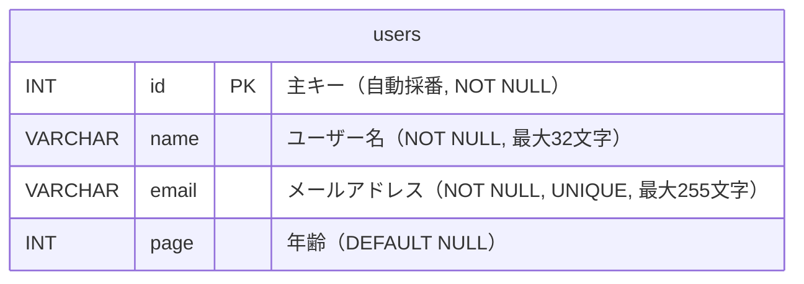

# VSCode で ER 図を作成する

VSCode に Mermaid 書ける環境を整える 
https://qiita.com/fu-a-sak/items/f49e75503c5d4557275c

## ER 図

```mermaid

erDiagram
    users {
        INT id PK "主キー（自動採番, NOT NULL）"
        VARCHAR name "ユーザー名（NOT NULL, 最大32文字）"
        VARCHAR email "メールアドレス（NOT NULL, UNIQUE, 最大255文字）"
        INT page "年齢（DEFAULT NULL）"
    }


```
